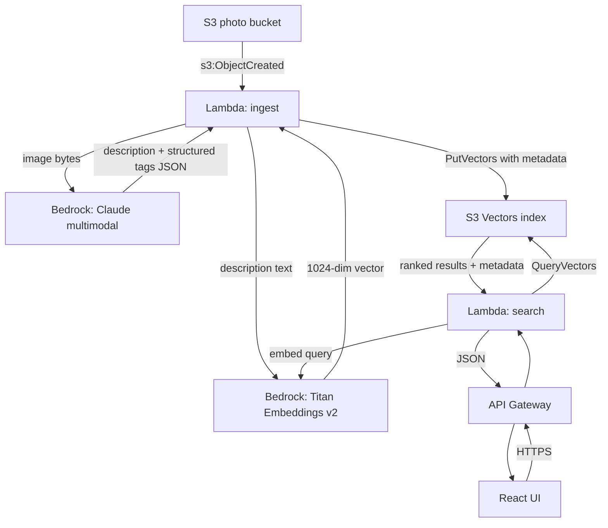

# PhotoScribe AI

> AI-powered semantic photo search on AWS. Upload photos. Bedrock describes them. Search anything.

PhotoScribe ingests photos from S3, uses Amazon Bedrock (Claude multimodal) to generate rich descriptions and structured tags, embeds those descriptions with Titan Embeddings, and stores the vectors in **Amazon S3 Vectors** for cost-effective semantic search. A React UI lets users search the library in natural language — things like *"confident golden-hour portrait of a woman laughing"* match photos by meaning, not keywords.

**Portfolio cost:** under $1/month for ~1,000 photos.
**Production comparable:** OpenSearch Serverless would cost ~$350/month idle. S3 Vectors is pay-per-use.

---

## Agent directives (READ FIRST)

This README is the spec. If you are an AI coding agent (Codex, Claude Code, etc.), treat these rules as hard constraints:

1. **Build phase by phase.** Do not skip ahead. Each phase has explicit acceptance criteria. Stop after each phase, run the acceptance tests, and report status before starting the next.
2. **Terraform workflow is `plan` then review then `apply`.** Never `terraform apply` without showing the plan output first.
3. **Amazon S3 Vectors is GA as of December 2025.** Your training data may be stale. When in doubt about S3 Vectors APIs, check the official docs at `https://docs.aws.amazon.com/AmazonS3/latest/userguide/s3-vectors.html` and the boto3 reference before writing code. Do not invent API signatures.
4. **Do not hard-code AWS account IDs, bucket names, or region-specific ARNs.** Parameterize via Terraform variables and pass via environment variables to Lambdas.
5. **Least-privilege IAM.** Every Lambda gets its own role scoped to the exact resources it needs. No wildcard `*` on actions or resources unless documented as intentional.
6. **Tag everything.** Every resource gets `Project=photoscribe`, `Environment=${var.env}`, `ManagedBy=terraform`.
7. **Secrets never go in code or Terraform state.** Use AWS Systems Manager Parameter Store (SecureString) or Secrets Manager.
8. **Write tests first for Lambda logic.** Use `moto` for AWS mocking. Target ≥80% coverage on handler and helper modules.
9. **Ask before making architecture changes.** If a constraint forces a material deviation (e.g., a library doesn't support S3 Vectors, region unavailable), stop and ask.
10. **Cost guardrails.** Add a billing alarm for $5/month during development. Surface this in `terraform/modules/observability`.

---

## Table of contents

1. [Architecture](#architecture)
2. [Prerequisites](#prerequisites)
3. [Repository structure](#repository-structure)
4. [Phase 1 — Infrastructure skeleton](#phase-1--infrastructure-skeleton)
5. [Phase 2 — Ingest pipeline](#phase-2--ingest-pipeline)
6. [Phase 3 — Search API](#phase-3--search-api)
7. [Phase 4 — React UI](#phase-4--react-ui)
8. [Data schemas](#data-schemas)
9. [Bedrock prompts](#bedrock-prompts)
10. [Deployment](#deployment)
11. [Testing](#testing)
12. [Cost model](#cost-model)
13. [Security checklist](#security-checklist)
14. [Troubleshooting](#troubleshooting)

---

## Architecture



### Data flow — ingest

1. A user or automated process uploads a photo (JPEG/PNG/WebP/HEIC) to the **photo bucket**.
2. S3 fires an `s3:ObjectCreated:*` event to EventBridge → triggers **ingest Lambda**.
3. Ingest Lambda downloads the image to `/tmp`, base64-encodes it, and sends it to **Bedrock Claude (multimodal)** with the system prompt in [Bedrock prompts](#bedrock-prompts). Claude returns strict JSON.
4. Ingest Lambda takes the `description` field and sends it to **Bedrock Titan Text Embeddings v2** to produce a 1024-dimensional float vector.
5. Ingest Lambda calls `PutVectors` on the **S3 Vectors index** with the vector plus filterable and non-filterable metadata derived from Claude's JSON.
6. Ingest Lambda writes a summary row to CloudWatch Logs. No other database is needed — S3 Vectors holds the description, tags, and vector.

### Data flow — search

1. User types a query in the React UI.
2. UI sends `GET /search?q=<query>&filter=<optional json>` to API Gateway.
3. **Search Lambda** calls Titan Embeddings on the query text to get a query vector.
4. Search Lambda calls `QueryVectors` on the index with the query vector and any metadata filters, requesting the top K (default 20) results.
5. S3 Vectors returns ranked matches including stored non-filterable metadata (description, alt_text, s3_url, etc.).
6. Search Lambda generates pre-signed S3 URLs for thumbnails and returns JSON.
7. UI renders the grid.

---

## Prerequisites

| Tool | Minimum version | Install |
|---|---|---|
| AWS CLI | 2.17.0 | `brew install awscli` / official installer |
| Terraform | 1.9.0 | `brew install terraform` / tfenv |
| Python | 3.12 | pyenv recommended |
| Node | 20 LTS | nvm recommended |
| pnpm | 9.x | `npm i -g pnpm` |
| Docker | any recent | for Lambda container builds if chosen |
| Git | 2.40+ | |
| jq | 1.7+ | for scripts |

**AWS account setup:**
- An AWS account with admin-equivalent permissions for the deploying IAM identity.
- Bedrock model access enabled in your target region for:
  - `anthropic.claude-3-5-sonnet-20241022-v2:0` (or the latest Sonnet cross-region inference profile, e.g. `us.anthropic.claude-sonnet-4-*`)
  - `amazon.titan-embed-text-v2:0`
- S3 Vectors must be available in your target region. As of GA (Dec 2025), supported regions include `us-east-1`, `us-east-2`, `us-west-2`, `eu-west-1`, `eu-central-1`, `ap-northeast-1`, among others. Verify before deploying.
- An S3 bucket for remote Terraform state and a DynamoDB table for state locking. Bootstrap script in `scripts/bootstrap-remote-state.sh`.

**Default region:** `us-east-1` unless `TF_VAR_region` is overridden.

---

## Repository structure

```
photoscribe-ai/
├── README.md
├── AGENTS.md                            # Agent-specific brief (mirrors directives above)
├── .gitignore
├── .pre-commit-config.yaml
├── .github/
│   └── workflows/
│       ├── terraform-plan.yml           # on PR
│       ├── terraform-apply.yml          # on merge to main
│       ├── lambda-test.yml              # pytest on Lambda changes
│       └── frontend-build.yml           # build + deploy React to S3 + CloudFront
├── scripts/
│   ├── bootstrap-remote-state.sh        # Creates TF state bucket + lock table
│   ├── grant-bedrock-access.sh          # CLI helper for model access
│   └── seed-photos.sh                   # Uploads ~20 sample photos for testing
├── terraform/
│   ├── main.tf                          # Root module wiring
│   ├── variables.tf
│   ├── outputs.tf
│   ├── versions.tf                      # Provider pins
│   ├── backend.tf                       # Remote state
│   ├── envs/
│   │   ├── dev.tfvars
│   │   └── prod.tfvars
│   └── modules/
│       ├── storage/                     # S3 photo bucket + lifecycle rules
│       ├── vectors/                     # S3 Vectors bucket + index
│       ├── ingest/                      # Ingest Lambda + EventBridge rule + IAM
│       ├── search/                      # Search Lambda + API Gateway + IAM
│       ├── frontend/                    # CloudFront + S3 static site + OAC
│       └── observability/               # CloudWatch log groups, billing alarm, dashboard
├── lambdas/
│   ├── ingest/
│   │   ├── handler.py
│   │   ├── bedrock.py                   # Claude + Titan wrappers
│   │   ├── vectors.py                   # S3 Vectors client
│   │   ├── schema.py                    # Pydantic models for Claude output
│   │   ├── prompts.py                   # System prompt
│   │   ├── requirements.txt
│   │   ├── requirements-dev.txt
│   │   └── tests/
│   │       ├── test_handler.py
│   │       ├── test_bedrock.py
│   │       ├── test_vectors.py
│   │       └── fixtures/
│   │           └── sample_claude_response.json
│   └── search/
│       ├── handler.py
│       ├── bedrock.py                   # Titan only
│       ├── vectors.py                   # Query client
│       ├── requirements.txt
│       └── tests/
├── frontend/
│   ├── package.json
│   ├── vite.config.ts
│   ├── tsconfig.json
│   ├── index.html
│   ├── .env.example
│   └── src/
│       ├── main.tsx
│       ├── App.tsx
│       ├── api.ts
│       ├── components/
│       │   ├── SearchBar.tsx
│       │   ├── PhotoGrid.tsx
│       │   ├── PhotoCard.tsx
│       │   └── FilterPanel.tsx
│       └── types.ts
└── docs/
    ├── prompts.md                       # Design rationale for the Claude prompt
    ├── cost-model.md                    # Cost breakdown at different scales
    └── s3-vectors-notes.md              # Field notes on S3 Vectors gotchas
```

---

## Phase 1 — Infrastructure skeleton

**Goal:** Land a working Terraform deploy of empty S3 buckets, an S3 Vectors index, two placeholder Lambdas that log "hello", the API Gateway, and the GitHub Actions CI. No AI yet. Prove the plumbing works end to end.

### Tasks

1. Initialize the repo with the structure in [Repository structure](#repository-structure). Create all empty files and directories.
2. Write `scripts/bootstrap-remote-state.sh` that creates an S3 bucket `photoscribe-tfstate-<account-id>-<region>` with versioning + SSE-S3, and a DynamoDB table `photoscribe-tflock` with a `LockID` HashKey.
3. Write `terraform/backend.tf` referencing the above.
4. Pin providers in `terraform/versions.tf`:
   ```hcl
   terraform {
     required_version = ">= 1.9.0"
     required_providers {
       aws = {
         source  = "hashicorp/aws"
         version = ">= 5.80"
       }
     }
   }
   ```
   Note: the AWS provider must support S3 Vectors resources (`aws_s3vectors_bucket`, `aws_s3vectors_index`). If the current provider version does not yet support these resources, use `awscc` provider or fall back to `null_resource` with `local-exec` calling the AWS CLI. Document the choice in `docs/s3-vectors-notes.md`.
5. Implement `modules/storage`: an S3 photo bucket with Block Public Access = on, SSE-S3, versioning on, lifecycle rule to transition originals to Infrequent Access after 90 days.
6. Implement `modules/vectors`: an S3 Vectors bucket and one vector index named `photos` with dimension `1024` and distance metric `cosine`. Configure the index with filterable metadata keys: `mood`, `scene_type`, `lighting`, `time_of_day`, `people_count`, `date_added`, `aspect_ratio`. Non-filterable keys will be added at write time: `description`, `alt_text`, `seo_caption`, `s3_key`, `s3_uri`, `subjects_csv`, `colors_csv`, `objects_csv`.
7. Implement `modules/ingest`: a Python 3.12 Lambda with a placeholder handler that logs the incoming event and returns 200. 512 MB memory, 60 s timeout. Give it an IAM role with only `logs:*` on its own log group for now — expand in Phase 2.
8. Implement `modules/search`: a Python 3.12 Lambda placeholder + HTTP API Gateway (v2) with a `GET /search` route and CORS configured for the frontend origin.
9. Implement `modules/observability`: a CloudWatch log group per Lambda with 14-day retention, and a billing alarm at $5/month threshold via SNS to an email var.
10. Wire the modules in `terraform/main.tf`. Add `terraform/envs/dev.tfvars` with `env = "dev"`, `region = "us-east-1"`, `alert_email = "..."`, `frontend_origin = "http://localhost:5173"`.
11. Write GitHub Actions:
    - `terraform-plan.yml`: runs on PRs that touch `terraform/**`. Uses OIDC to assume a plan-only role. Posts plan output as a PR comment.
    - `terraform-apply.yml`: runs on merge to `main`. Uses OIDC to assume an apply role.
    - `lambda-test.yml`: runs pytest on Lambda changes.
12. Pre-commit hooks: `terraform fmt`, `tflint`, `ruff`, `mypy`.

### Acceptance criteria

- `terraform init && terraform plan -var-file=envs/dev.tfvars` runs clean with zero errors.
- `terraform apply` creates every resource successfully.
- Uploading any JPEG to the photo bucket triggers the ingest Lambda (verify in CloudWatch Logs: "received event with N records").
- `curl <api_url>/search?q=test` returns a placeholder 200 JSON from the search Lambda.
- `terraform destroy` removes everything cleanly.
- GitHub Actions run green on a test PR.

**STOP. Report status. Do not proceed to Phase 2 until Phase 1 is verified.**

---

## Phase 2 — Ingest pipeline

**Goal:** Make the ingest Lambda actually call Bedrock Claude + Titan and write to the S3 Vectors index.

### Tasks

1. Expand the ingest Lambda IAM role with:
   ```json
   {
     "Statement": [
       {
         "Effect": "Allow",
         "Action": ["bedrock:InvokeModel"],
         "Resource": [
           "arn:aws:bedrock:${region}::foundation-model/anthropic.claude-3-5-sonnet-20241022-v2:0",
           "arn:aws:bedrock:${region}::foundation-model/amazon.titan-embed-text-v2:0"
         ]
       },
       {
         "Effect": "Allow",
         "Action": ["s3:GetObject"],
         "Resource": "${photo_bucket_arn}/*"
       },
       {
         "Effect": "Allow",
         "Action": ["s3vectors:PutVectors"],
         "Resource": "${vector_index_arn}"
       }
     ]
   }
   ```
2. Implement `lambdas/ingest/bedrock.py`:
   - `describe_image(image_bytes: bytes, media_type: str) -> PhotoMetadata`
   - `embed_text(text: str) -> list[float]` (returns 1024 floats)
   - Both use `boto3.client("bedrock-runtime")`.
   - Implement retries with exponential backoff for `ThrottlingException`.
3. Implement `lambdas/ingest/schema.py` using Pydantic v2 for the Claude output. See [Data schemas](#data-schemas).
4. Implement `lambdas/ingest/vectors.py`:
   - `put_vector(key: str, vector: list[float], filterable: dict, non_filterable: dict) -> None`
   - Uses the S3 Vectors boto3 client (`boto3.client("s3vectors")`).
   - The `key` is the S3 object key of the photo (used as the vector key for idempotency).
5. Implement `lambdas/ingest/handler.py`:
   ```python
   def handler(event, context):
       for record in event["Records"]:
           bucket = record["s3"]["bucket"]["name"]
           key = unquote(record["s3"]["object"]["key"])
           image_bytes, media_type = download_image(bucket, key)
           metadata = describe_image(image_bytes, media_type)
           vector = embed_text(metadata.description)
           filterable, non_filterable = split_metadata(metadata, s3_key=key, bucket=bucket)
           put_vector(key=key, vector=vector, filterable=filterable, non_filterable=non_filterable)
           log.info("indexed", extra={"key": key, "mood": metadata.mood})
   ```
6. Add `prompts.py` with the exact prompt in [Bedrock prompts](#bedrock-prompts).
7. Package dependencies: `boto3`, `pydantic>=2`, `tenacity`. Use a Lambda layer or build a zip with `pip install -t`.
8. Write tests using `moto` for S3 and a mocked `bedrock-runtime` client. Use `lambdas/ingest/tests/fixtures/sample_claude_response.json` as canned output.
9. Add a smoke-test script `scripts/seed-photos.sh` that uploads ~20 photos from a local directory to the photo bucket.

### Acceptance criteria

- `pytest lambdas/ingest -v` passes with ≥80% coverage.
- Running `./scripts/seed-photos.sh ./sample-photos/` uploads photos; within 30 seconds each one results in an indexed vector.
- Querying the index directly with AWS CLI (`aws s3vectors query-vectors`) on a sample vector returns the expected neighbors.
- No Lambda invocation exceeds 15 seconds end to end for a 5 MB photo.
- CloudWatch Logs show structured JSON entries with `key`, `mood`, `scene_type`, `latency_ms`.
- No ThrottlingException errors in logs for a batch of 20 photos.

**STOP. Report status.**

---

## Phase 3 — Search API

**Goal:** Make `GET /search?q=<query>` actually return ranked results from the index.

### Tasks

1. Expand the search Lambda IAM role with:
   - `bedrock:InvokeModel` on Titan only.
   - `s3vectors:QueryVectors` on the index.
   - `s3:GetObject` on the photo bucket (for pre-signed URL generation).
2. Implement `lambdas/search/bedrock.py` with just `embed_text` (shared logic — consider moving to a Lambda layer once duplicated).
3. Implement `lambdas/search/vectors.py`:
   - `query(vector: list[float], top_k: int = 20, filter: dict | None = None) -> list[Match]`
   - Handles the S3 Vectors `QueryVectors` API including optional metadata filter expressions.
4. Implement `lambdas/search/handler.py`:
   ```python
   def handler(event, context):
       params = event.get("queryStringParameters") or {}
       q = params.get("q", "").strip()
       if not q:
           return {"statusCode": 400, "body": json.dumps({"error": "q required"})}
       top_k = int(params.get("top_k", 20))
       filter_ = parse_filter(params.get("filter"))
       qvec = embed_text(q)
       matches = query(qvec, top_k=top_k, filter=filter_)
       results = [enrich_with_signed_url(m) for m in matches]
       return ok({"query": q, "results": results})
   ```
5. Filter DSL: the UI sends a simple JSON like `{"mood": "confident", "scene_type": "portrait"}`. Translate to the S3 Vectors filter format. Document accepted keys.
6. Pre-signed URLs: 15-minute expiry, returned as `thumbnail_url` per result. (Future: plug in CloudFront signed URLs if performance demands.)
7. Configure API Gateway route `GET /search` to invoke the Lambda. Add throttling (rate limit 100 rps, burst 200) and CORS for `var.frontend_origin`.
8. Optional (recommended): add `GET /photos/{key}` that returns a signed URL for a full-res image.
9. Write tests for handler logic including filter parsing and error paths.

### Acceptance criteria

- `curl "$API/search?q=golden+hour+portrait"` returns JSON with at least 1 result referencing a seeded photo.
- `curl "$API/search?q=outdoor&filter=%7B%22mood%22%3A%22serene%22%7D"` returns only photos where `mood=serene`.
- Search Lambda p95 latency under 1.2 seconds for top_k=20 with 1000 vectors in the index.
- Missing `q` returns a 400 with a clear error.
- CORS preflight (`OPTIONS /search`) returns the right headers for `var.frontend_origin`.

**STOP. Report status.**

---

## Phase 4 — React UI

**Goal:** Ship a clean search UI that showcases the tool in a portfolio/demo.

### Tasks

1. Scaffold with Vite + React + TypeScript: `pnpm create vite frontend -- --template react-ts`.
2. Dependencies: `react`, `react-dom`, `axios` (or native `fetch`), `tailwindcss`, `clsx`. Keep the stack light.
3. `.env` variables: `VITE_API_URL` (the API Gateway URL).
4. Components:
   - **SearchBar** — controlled input with debounced submit (300 ms). Shows keyboard shortcut hint ("press `/` to search"). Submit fires the search.
   - **FilterPanel** — pill-style filters for `mood`, `scene_type`, `lighting`, `time_of_day`. Multi-select optional. Clear button.
   - **PhotoGrid** — masonry or CSS grid. Lazy-load thumbnails with `loading="lazy"`. Use `srcset` if multiple sizes exist.
   - **PhotoCard** — thumbnail, description preview (2 lines clamped), mood badge, click-to-expand modal with full description and EXIF (if stored).
   - **EmptyState** — shown when zero results. Suggest broader queries.
5. Call order on submit: `GET $VITE_API_URL/search?q=...&filter=...` → render results. Show a loading skeleton grid during the request.
6. Accessibility: keyboard navigation through results, focus ring on cards, alt text on every image (use the `alt_text` field from the API).
7. Responsive: works well at 320 px and up. Grid columns scale with viewport.
8. Deploy: the `frontend` module in Terraform creates an S3 bucket + CloudFront distribution with OAC. A GitHub Action builds and syncs `dist/` to S3 on merge to main.
9. Add a simple landing section above the search: title, 1-sentence pitch, sample queries as clickable chips (e.g., *"confident portrait"*, *"cozy kitchen interior"*, *"sunset over water"*).

### Acceptance criteria

- Typing "confident portrait" and pressing Enter returns relevant seeded photos within 2 seconds.
- Grid is keyboard navigable. Tab cycles through cards. Enter opens the modal. Esc closes it.
- Lighthouse accessibility score ≥ 95 on the search page.
- Lighthouse performance score ≥ 85 (unoptimized photos count against this — use CloudFront and thumbnail generation if needed, tracked in future-work list).
- Mobile viewport (375 px): search, grid, and modal all usable with no horizontal scroll.

---

## Data schemas

### Claude multimodal output (ingest)

Returned as strict JSON, no markdown fences. Parsed via Pydantic v2:

```python
class PhotoMetadata(BaseModel):
    description: str = Field(..., min_length=20, max_length=500)
    alt_text: str = Field(..., max_length=160)
    seo_caption: str = Field(..., max_length=140)
    subjects: list[str] = Field(..., max_length=10)
    mood: Literal["joyful", "serene", "dramatic", "confident",
                  "melancholic", "energetic", "intimate", "tense",
                  "nostalgic", "mysterious", "playful", "neutral"]
    scene_type: Literal["portrait", "landscape", "product",
                        "architectural", "event", "lifestyle",
                        "abstract", "documentary", "interior",
                        "food", "street", "other"]
    dominant_colors: list[str] = Field(..., min_length=1, max_length=5)
    objects_detected: list[str] = Field(default_factory=list, max_length=15)
    lighting: Literal["golden_hour", "overcast", "studio",
                      "harsh_sun", "soft_diffused", "low_light",
                      "mixed", "backlit", "other"]
    time_of_day: Literal["morning", "midday", "afternoon",
                         "sunset", "night", "unknown"]
    people_count: int = Field(..., ge=0, le=50)
    aspect_ratio: Literal["portrait", "landscape", "square", "panoramic"]
```

If Claude returns invalid JSON or fails Pydantic validation, log the raw response and raise — DLQ captures the failure. Do not index partial data.

### S3 Vectors record

```json
{
  "key": "<s3_object_key>",
  "vector": [0.123, -0.456, ...],
  "filterable_metadata": {
    "mood": "confident",
    "scene_type": "portrait",
    "lighting": "golden_hour",
    "time_of_day": "sunset",
    "people_count": 1,
    "date_added": "2026-04-24",
    "aspect_ratio": "portrait"
  },
  "non_filterable_metadata": {
    "description": "<long text>",
    "alt_text": "<short>",
    "seo_caption": "<short>",
    "s3_key": "<key>",
    "s3_uri": "s3://<bucket>/<key>",
    "subjects_csv": "woman,laughter,outdoor",
    "colors_csv": "amber,cream,deep-green",
    "objects_csv": "woman,field,camera"
  }
}
```

Keep total metadata size well under S3 Vectors limits (≤50 keys total, ≤10 non-filterable). Truncate `description` to 500 chars before storing.

---

## Bedrock prompts

### System prompt for Claude (ingest)

Store this verbatim in `lambdas/ingest/prompts.py`:

```
You are an expert photo cataloger writing structured metadata for a
searchable photo library. You analyze photographs objectively and
produce concise, accurate descriptions suitable for both human readers
and vector search.

For the attached image, return ONLY a JSON object with exactly these
fields and no others:

{
  "description": "2-3 sentences capturing subject, composition, lighting, and mood. Written so a photographer or designer can immediately understand the image. No flowery adjectives. No speculation about identity, emotion, or context beyond what the image clearly shows.",
  "alt_text": "ONE concise sentence suitable for accessibility alt text. Under 160 chars.",
  "seo_caption": "An engaging caption under 140 chars suitable for social or SEO. Skip hashtags.",
  "subjects": ["up to 10 main subjects as single words or short phrases"],
  "mood": "ONE of: joyful, serene, dramatic, confident, melancholic, energetic, intimate, tense, nostalgic, mysterious, playful, neutral",
  "scene_type": "ONE of: portrait, landscape, product, architectural, event, lifestyle, abstract, documentary, interior, food, street, other",
  "dominant_colors": ["1 to 5 color names, plain English like 'amber', 'cream', 'deep green'"],
  "objects_detected": ["up to 15 notable objects"],
  "lighting": "ONE of: golden_hour, overcast, studio, harsh_sun, soft_diffused, low_light, mixed, backlit, other",
  "time_of_day": "ONE of: morning, midday, afternoon, sunset, night, unknown",
  "people_count": <integer 0-50, your best estimate of people visible>,
  "aspect_ratio": "ONE of: portrait, landscape, square, panoramic"
}

Rules:
- Return ONLY the JSON. No markdown fences. No commentary. No preamble.
- Do NOT identify real people by name even if recognizable. Use neutral descriptors like "woman in her 30s", "child".
- Do NOT speculate about emotions beyond what is visible in expression and body language.
- If the image is not a photograph (e.g. a screenshot, document, diagram), set scene_type to "other" and describe accordingly.
- Use American English.
```

### Invocation shape

```python
body = {
    "anthropic_version": "bedrock-2023-05-31",
    "max_tokens": 800,
    "system": SYSTEM_PROMPT,
    "messages": [{
        "role": "user",
        "content": [
            {"type": "image", "source": {"type": "base64", "media_type": media_type, "data": b64}},
            {"type": "text", "text": "Describe this photo per the schema."}
        ]
    }]
}
```

---

## Deployment

### First-time setup

```bash
# 1. Bootstrap remote state
./scripts/bootstrap-remote-state.sh us-east-1

# 2. Enable Bedrock model access (opens browser to console)
./scripts/grant-bedrock-access.sh

# 3. Init Terraform
cd terraform
terraform init -backend-config="bucket=photoscribe-tfstate-<account>-us-east-1" \
               -backend-config="key=dev/terraform.tfstate" \
               -backend-config="region=us-east-1" \
               -backend-config="dynamodb_table=photoscribe-tflock"

# 4. Plan + apply
terraform plan -var-file=envs/dev.tfvars -out=plan.tfplan
terraform apply plan.tfplan

# 5. Grab outputs
terraform output -json > ../frontend/.aws-outputs.json

# 6. Build + deploy Lambdas (handled by GHA normally; manual:)
cd ../lambdas/ingest && pip install -t package -r requirements.txt && zip -r ../../dist/ingest.zip package handler.py ...
# Terraform apply picks up the new zip via hash_file

# 7. Build + deploy frontend
cd ../../frontend && pnpm install && pnpm build
aws s3 sync dist/ s3://$(terraform -chdir=../terraform output -raw frontend_bucket)/ --delete
aws cloudfront create-invalidation --distribution-id $(terraform -chdir=../terraform output -raw cf_distribution_id) --paths '/*'

# 8. Seed and test
cd .. && ./scripts/seed-photos.sh ./sample-photos
open "$(terraform -chdir=terraform output -raw frontend_url)"
```

### Ongoing

`git push` triggers the right GitHub Actions. PRs get a plan comment. Merges to `main` apply.

---

## Testing

### Unit tests
- `pytest lambdas/ingest -v --cov=. --cov-report=term-missing`
- `pytest lambdas/search -v --cov=. --cov-report=term-missing`
- Target ≥80% line coverage.

### Integration test (manual smoke)
1. Apply Terraform to a clean dev environment.
2. Run `scripts/seed-photos.sh ./sample-photos` (expect 20 photos, mix of portraits, landscapes, products).
3. Wait 60 seconds.
4. Open the frontend, search: *"outdoor portrait"*, *"warm interior"*, *"product on white"* — each should surface the expected category.
5. Apply a filter `mood=confident` — verify results narrow.
6. Check CloudWatch for errors. Zero tolerance for 5xx in the search Lambda.

### Load test (optional, stretch)
- Use `k6` to hit `/search` at 10 rps for 60 s. Capture p95 latency.

### Failure modes to test explicitly
- Upload a non-image file (e.g., `.txt`) → ingest should log and skip gracefully, not crash.
- Upload a HEIC file → should convert or reject cleanly with a logged reason.
- Upload a 20 MB image → should succeed (ingest Lambda has 60s timeout; image gets resized if needed before Bedrock).
- Submit `q=""` → 400.
- Submit an invalid filter JSON → 400.

---

## Cost model

| Scale | Storage (vectors) | PUT ops | Query ops | Bedrock ingest | Bedrock search | Total est. |
|---|---|---|---|---|---|---|
| 100 photos / 50 queries mo | ~$0.00 | ~$0.00 | ~$0.00 | ~$0.30 | ~$0.01 | **~$0.31** |
| 1,000 photos / 500 queries mo | ~$0.01 | ~$0.01 | ~$0.01 | ~$3.00 | ~$0.10 | **~$3.13** |
| 10,000 photos / 5,000 queries mo | ~$0.06 | ~$0.10 | ~$0.15 | ~$30.00 | ~$1.00 | **~$31.31** |

Bedrock Claude is the dominant cost — that's the describe step. Keep it down by processing each photo exactly once (vector key = S3 object key gives natural idempotency). Consider batching Claude calls if volume grows.

Full details and assumptions in `docs/cost-model.md`.

---

## Security checklist

Gate every phase against this list. Do not skip items.

- [ ] S3 photo bucket: Block Public Access = all four on.
- [ ] S3 photo bucket: SSE-S3 or SSE-KMS enabled.
- [ ] S3 Vectors index: default SSE-S3, optional SSE-KMS with customer-managed key.
- [ ] Lambda execution roles: no `*` on `Action` or `Resource` except documented CloudWatch Logs access.
- [ ] API Gateway: rate limiting on (100 rps, 200 burst default).
- [ ] API Gateway: CORS allowed origin is the exact CloudFront domain, not `*`.
- [ ] CloudFront: HTTPS only, TLS 1.2+, OAC on the S3 origin.
- [ ] CloudFront: S3 bucket blocks all direct public access.
- [ ] No secrets in code, in Terraform state plaintext, or in GitHub Actions logs.
- [ ] GitHub Actions uses OIDC to assume AWS roles (no long-lived access keys).
- [ ] Billing alarm at $5/month during dev, $X at prod.
- [ ] CloudTrail enabled on the account (if not already).
- [ ] `terraform plan` output reviewed by a human before `apply` on `main`.

---

## Troubleshooting

**`AccessDeniedException` on `bedrock:InvokeModel`.** Bedrock model access is granted per-model per-region. Open the Bedrock console, click *Model access*, request access for Claude and Titan, wait ~minutes. Re-run.

**`ResourceNotFoundException` on S3 Vectors bucket.** Region mismatch is the #1 cause — S3 Vectors is regional. Confirm the boto3 client region matches the index region.

**Ingest Lambda timing out.** Usually Claude response time with very large images. Pre-resize images over 4 MB in the Lambda (using Pillow) before calling Bedrock. Keep longest edge ≤ 2048 px.

**Claude returns JSON wrapped in markdown fences.** Tighten the prompt (the provided prompt in this README says "No markdown fences"). If it still happens, strip fences defensively in `schema.py`.

**Titan Embeddings returns wrong dimension.** Confirm model ID is `amazon.titan-embed-text-v2:0` (not v1). The v2 model defaults to 1024 dimensions.

**`QueryVectors` returns no results.** Confirm vectors were actually written (`aws s3vectors list-vectors --vector-bucket-name ... --index-name photos --max-results 5`). If the index is empty, the ingest pipeline silently failed — check ingest Lambda CloudWatch Logs.

**Search Lambda p95 > 2 seconds.** Cold start dominates for a rarely-called Lambda. Options: provisioned concurrency (costs money), or a CloudWatch warm-up rule hitting `/search?q=warmup` every 5 minutes.

**React UI returns CORS errors.** API Gateway CORS config must list the exact frontend origin. Local dev uses `http://localhost:5173`, production uses the CloudFront domain. Update `frontend_origin` in tfvars.

---

## Post-MVP extensions

Once Phases 1–4 are done, consider:

- **Batch re-index** — a Lambda that re-processes existing photos when the prompt is updated.
- **Thumbnail pipeline** — a separate Lambda that writes resized versions (200/800/1600 px) to a `photos-thumbs` bucket, served via CloudFront.
- **Multimodal embeddings** — add Titan Multimodal Embeddings alongside text embeddings for visual similarity search ("find photos that look like this one").
- **Bedrock Knowledge Base integration** — register the S3 Vectors index as a Bedrock KB to power a chat-style "ask your photo library" agent.
- **Per-user libraries** — Cognito auth, per-user index prefixes, row-level filtering.
- **EXIF enrichment** — read EXIF (camera, lens, GPS) in the ingest Lambda and store as additional metadata.
- **Duplicate detection** — perceptual hash via `imagehash` library, flag near-dupes.

---

## License

MIT. See `LICENSE`.
