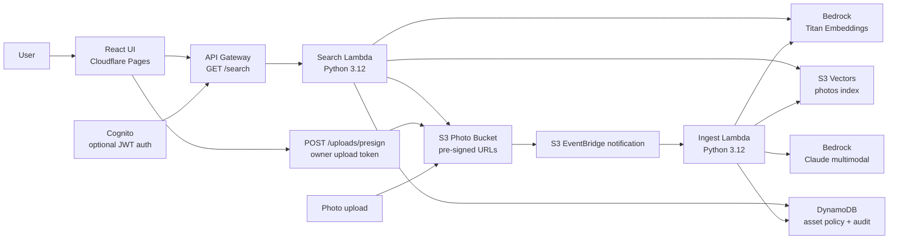

# PhotoScribe AI

[](https://github.com/manynames3/photoscribe-ai/actions/workflows/cloudflare-pages.yml)
[](https://github.com/manynames3/photoscribe-ai/actions/workflows/lambda-test.yml)
[](https://github.com/manynames3/photoscribe-ai/actions/workflows/terraform-plan.yml)
[](https://photoscribe-ai.pages.dev/)
[](#architecture)
[](#deployment)
[](#tech-stack)

PhotoScribe AI is a serverless AI media asset platform for searching enterprise photo libraries by meaning instead of filenames. Uploaded images are stored privately in Amazon S3, described with Amazon Bedrock Claude, embedded with Titan Text Embeddings, indexed in Amazon S3 Vectors, governed with DynamoDB asset policy/audit tables, and searched through a React + TypeScript UI deployed on Cloudflare Pages.

**Live demo:** [photoscribe-ai.pages.dev](https://photoscribe-ai.pages.dev/)

> Enterprise media intelligence for organizations that can't afford to lose assets in a folder.

PhotoScribe AI solves a real enterprise problem: thousands of photos sitting in shared drives with filenames like `IMG_4872.jpg`, undiscoverable, untagged, and unused. Marketing teams cannot find campaign photos, HR manually renames portraits, investor relations repeats photo shoots, and compliance teams cannot easily audit whether released images contain sensitive or identifiable content.

## About

This project demonstrates how I design, deploy, and operate a small cloud-native application with infrastructure as code, least-privilege IAM, CI/CD, cloud cost awareness, and production-style security controls. The user-facing app lets someone search a governed media library by natural language instead of filenames or manually-entered tags.

What I built:

- an AWS ingest pipeline that reacts to S3 uploads and creates AI-generated photo metadata
- a vector search backend using Bedrock embeddings and S3 Vectors
- an HTTP search API backed by AWS Lambda and API Gateway
- a responsive React interface with metadata filters, browser uploads, and signed image previews
- optional Cognito JWT authentication for private-library deployments
- DynamoDB asset policy and audit tables for review status, object-level visibility, and search audit records
- Terraform modules for storage, vectors, Lambdas, API Gateway, auth, governance, observability, and optional AWS frontend hosting
- GitHub Actions workflows for Cloudflare Pages deployment, Lambda tests, and Terraform planning

## Product Fit

PhotoScribe is designed for organizations that manage large volumes of visual assets across departments with different governance needs: healthcare, real estate, retail, financial services, professional services, universities, and corporate communications teams.

Example searches:

- `confident physician at nurses station`
- `outdoor community event navy blue uniforms`
- `all 2024 employee portraits`
- `warehouse safety inspection`
- `executive planning session`

See [docs/use-cases.md](docs/use-cases.md) for a healthcare and enterprise use-case breakdown.

## Companion Tooling

I also built [Bulk Image Size Reducer](https://bulk-image-size-reducer.pages.dev/) ([GitHub](https://github.com/manynames3/bulk-image-size-reducer)) to prepare image-heavy websites and portfolio demos for faster loading. It batch-converts large JPEG/PNG assets to optimized WebP/JPEG/PNG outputs in the browser, which is useful before publishing image-heavy pages where page weight, Core Web Vitals, and SEO matter.

For the PhotoScribe demo asset workflow, the companion tool reduced multi-megabyte JPEG exports into WebP files around 89-362 KB in the sample batch, with per-file savings shown between 86% and 97%. See [docs/image-optimization-workflow.md](docs/image-optimization-workflow.md).

## Tech Stack

| Area | Technology |
|---|---|
| Frontend | React 18, TypeScript, Vite, CSS |
| Frontend hosting | Cloudflare Pages, Wrangler direct upload via GitHub Actions |
| API | Amazon API Gateway HTTP API |
| Auth | Amazon Cognito User Pools, API Gateway JWT authorizer |
| Compute | AWS Lambda, Python 3.12 |
| AI services | Amazon Bedrock Claude multimodal, Amazon Titan Text Embeddings v2 |
| Vector search | Amazon S3 Vectors |
| Storage | Amazon S3, S3 versioning, lifecycle rules, pre-signed URLs |
| Governance | Amazon DynamoDB asset policy table, DynamoDB audit log table with TTL |
| Infrastructure | Terraform, AWS provider, AWS Cloud Control provider (`awscc`) |
| CI/CD | GitHub Actions, GitHub repository secrets and variables |
| Observability | CloudWatch Logs, log retention, SNS billing alarm |

## Engineering Highlights

- **Serverless runtime model:** S3 upload events trigger an ingest Lambda; search requests go through API Gateway to a separate query Lambda.
- **Semantic search:** Photo descriptions and user queries are embedded into the same 1024-dimensional vector space before nearest-neighbor search.
- **Least-privilege IAM:** Each Lambda has its own IAM role scoped to the Bedrock, S3, S3 Vectors, and CloudWatch resources it needs.
- **Private-library controls:** Terraform can enable Cognito JWT auth on `GET /search`; Lambda enforces DynamoDB asset policies before issuing signed image URLs.
- **Audit and review workflow:** Ingest creates asset policy rows with review status and visibility; search writes audit events with result counts and policy-filtered counts.
- **Safe browser uploads:** The UI requests owner-gated pre-signed S3 PUT URLs, uploads directly to the private bucket, and lets the existing ingest pipeline index the new assets.
- **Cost-aware architecture:** S3 Vectors avoids always-on vector infrastructure for a low-volume portfolio workload.
- **Infrastructure as code:** Terraform defines AWS storage, vector, compute, API, observability, and optional frontend hosting resources.
- **CI/CD-ready frontend:** Every push can build and deploy the Vite frontend to Cloudflare Pages using a GitHub Actions secret for Cloudflare deploy access.
- **Public repo secret handling:** deploy credentials live in GitHub Actions secrets; only public values such as `VITE_API_URL` are exposed to the browser.

## Architecture

Detailed architecture documentation lives in [docs/architecture.md](docs/architecture.md).

High-level flow:



Architecture decision records are in [docs/adrs](docs/adrs/README.md).

## Repository Structure

```text
photoscribe-ai/
├── frontend/                  # React + TypeScript UI
├── lambdas/
│   ├── ingest/                # S3 upload processing, Bedrock description, vector writes
│   └── search/                # Query embedding, S3 Vectors search, signed image URLs
├── terraform/
│   ├── modules/               # Storage, vectors, ingest, search, auth, governance, frontend, observability
│   └── envs/                  # Environment variable files
├── scripts/                   # Remote state bootstrap and seed helpers
├── docs/                      # Architecture, ADRs, use cases, cost, optimization notes
└── .github/workflows/         # Cloudflare Pages, Lambda tests, Terraform workflows
```

## Local Development

Prerequisites:

- Node.js 20+
- Python 3.12+
- Terraform 1.9+
- AWS CLI configured for the target AWS account
- Bedrock model access enabled in the target region

Run the frontend locally:

```bash
cd frontend
npm ci
npm run dev
```

Run Lambda tests:

```bash
PYTHONPATH=. pytest lambdas -v --cov=lambdas --cov-report=term-missing
```

Build the frontend:

```bash
cd frontend
npm run build
```

## Deployment

The deployed app currently uses Cloudflare Pages for the frontend and AWS for the backend.

Frontend deployment:

- GitHub Actions workflow: [.github/workflows/cloudflare-pages.yml](.github/workflows/cloudflare-pages.yml)
- Build command: `npm ci && npm run build`
- Deploy command: `wrangler pages deploy frontend/dist`
- Required GitHub variables: `CLOUDFLARE_ACCOUNT_ID`, `CLOUDFLARE_PAGES_PROJECT_NAME`, `VITE_API_URL`
- Required GitHub secret: `CLOUDFLARE_API_TOKEN`

Backend deployment:

```bash
./scripts/bootstrap-remote-state.sh us-east-1
cd terraform
terraform init -backend-config=dev.backend.hcl
terraform plan -var-file=envs/dev.tfvars -var-file=envs/dev.cloudflare.tfvars
terraform apply
```

Useful Terraform outputs:

- `photo_bucket_name`
- `vector_bucket_name`
- `vector_index_arn`
- `search_api_url`
- `asset_policy_table_name`
- `audit_log_table_name`
- `cognito_user_pool_id` when `enable_api_auth = true`

Enable browser uploads:

```bash
UPLOAD_TOKEN="choose-a-long-random-owner-token"
UPLOAD_TOKEN_SHA256="$(printf '%s' "$UPLOAD_TOKEN" | shasum -a 256 | awk '{print $1}')"

terraform plan \
  -var-file=envs/dev.tfvars \
  -var-file=envs/dev.cloudflare.tfvars \
  -var="upload_token_sha256=$UPLOAD_TOKEN_SHA256"

terraform apply \
  -var-file=envs/dev.tfvars \
  -var-file=envs/dev.cloudflare.tfvars \
  -var="upload_token_sha256=$UPLOAD_TOKEN_SHA256"
```

After deploy, paste the raw `UPLOAD_TOKEN` into the frontend upload form. Only the token hash should be stored in Terraform variables; the raw token should not be committed.

To seed photos after deploy:

```bash
./scripts/seed-photos.sh ./sample-photos "$(terraform -chdir=terraform output -raw photo_bucket_name)"
```

## Testing

Automated checks available in the repo:

- `npm run build` in `frontend/`
- `PYTHONPATH=. pytest lambdas -v --cov=lambdas --cov-report=term-missing`
- `terraform fmt -check -recursive`
- `terraform validate`
- `git diff --check`

Manual smoke test:

1. Upload a JPEG to the photo bucket.
2. Confirm the ingest Lambda logs an `indexed` entry in CloudWatch.
3. Call `GET /search?q=<query>` on the API Gateway URL.
4. Open the Cloudflare Pages frontend and confirm results render with signed image URLs.

## Security And Privacy

- S3 photo buckets block public access.
- Search results return short-lived pre-signed S3 URLs instead of public bucket objects.
- API Gateway CORS is configured for known frontend origins.
- Lambda IAM policies are scoped to the resources used by each function.
- Optional Cognito JWT auth can be enabled with `enable_api_auth = true`.
- Search Lambda checks DynamoDB asset policy rows before returning signed URLs.
- Browser uploads require an owner upload token and return pre-signed S3 PUT URLs instead of exposing AWS credentials.
- Search audit records are written to DynamoDB with TTL-based retention.
- GitHub Actions uses secrets for deployment credentials.
- CloudWatch log groups use retention policies.
- A development billing alarm is provisioned through Terraform.

Current privacy limitation: the public portfolio demo keeps `enable_api_auth = false`, so demo photos should be treated as public-facing content once indexed. Browser uploads are disabled unless `upload_token_sha256` is configured. A private deployment should enable Cognito auth, set `default_asset_review_status = "pending_review"` if human approval is required, and set `missing_asset_policy_default = "deny"` after existing assets have policy rows.

## Cost Model

The architecture is designed for low-volume portfolio usage. The main cost driver is Bedrock image description during ingest; S3 storage, S3 Vectors storage, Lambda, DynamoDB, and API Gateway are small at demo scale. S3 Vectors avoids always-on vector database or OpenSearch cluster costs for a portfolio-sized dataset. See [docs/cost-model.md](docs/cost-model.md) for notes and assumptions.

## Limitations

- The public demo leaves Cognito authentication disabled to keep the portfolio site easy to view.
- Search returns signed URLs for the original uploaded objects; a thumbnail generation pipeline is future work.
- The review workflow is policy-table based; a full admin console for approving/rejecting assets is future work.
- The Terraform repo still includes optional AWS S3 + CloudFront frontend hosting modules, but the active public frontend is Cloudflare Pages.
- The Cloudflare Pages project is a direct-upload project, not Cloudflare Git integration.
- The vector index is optimized for low-volume demo workloads, not multi-tenant enterprise photo libraries.

## Troubleshooting

**Bedrock access errors:** confirm model access is enabled for Claude and Titan in the selected AWS region.

**No search results:** verify the ingest Lambda ran, then check the S3 Vectors index for stored vectors.

**CORS errors:** confirm API Gateway allows the exact frontend origin, including `https://photoscribe-ai.pages.dev`.

**Cloudflare deploy failures:** confirm `CLOUDFLARE_API_TOKEN` is a GitHub Actions secret with Cloudflare Pages edit permission.

## Future Work

- Build an admin/reviewer UI for approving, rejecting, and restricting assets.
- Add automated moderation with Amazon Rekognition or a Bedrock guardrail workflow before human review.
- Generate and serve responsive thumbnails.
- Add a re-indexing workflow for prompt/model changes.
- Add CloudWatch dashboards and alarms for API 5xx, Lambda errors, and ingest latency.
- Add a public runbook for incident response and operations.

## License

MIT. See `LICENSE`.
