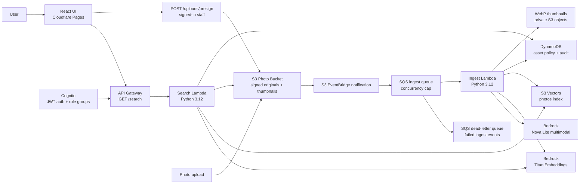

# PhotoScribe AI

[](https://github.com/manynames3/photoscribe-ai/actions/workflows/cloudflare-pages.yml)
[](https://github.com/manynames3/photoscribe-ai/actions/workflows/lambda-test.yml)
[](https://github.com/manynames3/photoscribe-ai/actions/workflows/terraform-plan.yml)
[](https://photoscribe-ai.pages.dev/)
[](#architecture)
[](#deployment)
[](#tech-stack)

PhotoScribe AI is a serverless AI media asset platform for searching enterprise photo libraries by meaning instead of filenames. Uploaded images are stored privately in Amazon S3, described with Amazon Bedrock Nova Lite, embedded with Titan Text Embeddings, indexed in Amazon S3 Vectors, governed with DynamoDB asset policy/audit tables, and searched through a React + TypeScript UI deployed on Cloudflare Pages.

The product-facing UI is branded as **CareFrame**, a hospital media workspace for finding, reviewing, and reusing approved internal photos.

**Live preview:** [photoscribe-ai.pages.dev](https://photoscribe-ai.pages.dev/)

## TL;DR

PhotoScribe AI is a production-style cloud portfolio project for enterprise media intelligence: a public product landing page explains the system, while the staff workspace at [`/app`](https://photoscribe-ai.pages.dev/app) lets authorized users search, upload, review, and govern private hospital media assets. The backend uses AWS serverless services: S3, Lambda, API Gateway, Cognito, Bedrock Nova Lite, Titan Embeddings, S3 Vectors, DynamoDB, SQS/DLQ, CloudWatch alarms, optional CloudWatch dashboard, Terraform, and GitHub Actions CI/CD. The project is designed to show real AWS architecture skill, infrastructure as code, secure auth/config handling, failure isolation, observability, and cost-aware AI/vector search design.

> Enterprise media intelligence for organizations that can't afford to lose assets in a folder.

PhotoScribe AI solves a real enterprise problem: thousands of photos sitting in shared drives with filenames like `IMG_4872.jpg`, undiscoverable, untagged, and unused. Marketing teams cannot find campaign photos, HR manually renames portraits, investor relations repeats photo shoots, and compliance teams cannot easily audit whether released images contain sensitive or identifiable content.

## Preview Flow

Use the public landing page to understand the product, then open [`/app`](https://photoscribe-ai.pages.dev/app) to try the workspace. If the backend is not configured locally, the frontend falls back to bundled sample results so the product workflow can still be reviewed.

1. Search like a hospital staff request: `hospital executive headshot`, `community health event`, or `hospital facilities documentation`.
2. Open a result and review the non-technical asset context: recommended use, owner department, consent, rights, campaign, staff names, and location.
3. Sign in with an invited Cognito staff user to upload files, load the review queue, approve/restrict assets, and add searchable human metadata.

The public preview is sample-first by design. Private uploads and review tools require staff access because image ingest triggers real AWS processing cost.

For a controlled buyer or hiring-manager walkthrough, use the [pilot runbook](docs/pilot-runbook.md).

## Sellable MVP Direction

The credible first commercial offer is a managed pilot for a hospital marketing or communications team, not a broad self-serve DAM replacement. The pilot scope is one private media library, one buyer workflow, and one measurable outcome: help staff find and reuse approved images faster while preserving consent, usage-rights, and review context.

Suggested first offer: managed setup plus a monthly private workspace. Keep public preview access free, but make private uploads, staff invites, review workflow, and signed asset delivery paid or manually approved.

The first paid version should remain a single-customer managed pilot. Multi-tenant account isolation, self-serve billing, and enterprise SSO are intentionally deferred until one buyer workflow is validated.

## About

This project demonstrates how I design, deploy, and operate a small cloud-native application with infrastructure as code, least-privilege IAM, CI/CD, cloud cost awareness, and production-style security controls. The user-facing app lets someone search a governed media library by natural language instead of filenames or manually-entered tags.

What I built:

- an AWS ingest pipeline that reacts to S3 uploads and creates AI-generated photo metadata
- an ingest-time WebP thumbnail pipeline for faster UI previews while originals remain private
- a vector search backend using Bedrock embeddings and S3 Vectors
- an HTTP search API backed by AWS Lambda and API Gateway
- a responsive React interface with Cognito login, metadata filters, browser uploads, review queue, and signed image previews
- Cognito JWT authentication with admin, reviewer, marketing, HR, compliance, and facilities role groups
- DynamoDB asset policy and audit tables for review status, object-level visibility, curator tags, usage rights, consent status, and search audit records
- Terraform modules for storage, vectors, Lambdas, API Gateway, auth, governance, observability, and optional AWS frontend hosting
- GitHub Actions workflows for Cloudflare Pages deployment, Lambda tests, and Terraform planning

## Product Fit

PhotoScribe's primary pilot market is hospital marketing and communications teams that manage approved internal media across departments. The same architecture can later support other asset-heavy organizations such as universities, real estate firms, retail teams, financial services, and corporate communications teams, but the current product experience is intentionally healthcare-first.

Example searches:

- `confident physician at nurses station`
- `outdoor community event navy blue uniforms`
- `all 2024 employee portraits`
- `warehouse safety inspection`
- `executive planning session`

See [docs/use-cases.md](docs/use-cases.md) for a healthcare and enterprise use-case breakdown.

## Companion Tooling

I also built [Bulk Image Size Reducer](https://bulk-image-size-reducer.pages.dev/) ([GitHub](https://github.com/manynames3/bulk-image-size-reducer)) to prepare image-heavy websites and portfolio previews for faster loading. It batch-converts large JPEG/PNG assets to optimized WebP/JPEG/PNG outputs in the browser, which is useful before publishing image-heavy pages where page weight, Core Web Vitals, and SEO matter.

For the PhotoScribe sample asset workflow, the companion tool reduced multi-megabyte JPEG exports into WebP files around 89-362 KB in the sample batch, with per-file savings shown between 86% and 97%. See [docs/image-optimization-workflow.md](docs/image-optimization-workflow.md).

## Tech Stack

| Area | Technology |
|---|---|
| Frontend | React 18, TypeScript, Vite, CSS |
| Frontend hosting | Cloudflare Pages, Wrangler direct upload via GitHub Actions |
| API | Amazon API Gateway HTTP API |
| Auth | Amazon Cognito User Pools, API Gateway JWT authorizer |
| Compute | AWS Lambda, Python 3.12 |
| AI services | Amazon Bedrock Nova Lite multimodal, Amazon Titan Text Embeddings v2 |
| Vector search | Amazon S3 Vectors |
| Storage | Amazon S3, S3 versioning, lifecycle rules, generated WebP thumbnails, pre-signed URLs |
| Queueing | Amazon SQS ingest queue with dead-letter queue |
| Governance | Amazon DynamoDB asset policy table, DynamoDB audit log table with TTL |
| Infrastructure | Terraform, AWS provider, AWS Cloud Control provider (`awscc`) |
| CI/CD | GitHub Actions, GitHub repository secrets and variables |
| Observability | CloudWatch Logs, operational CloudWatch alarms, optional CloudWatch dashboard, SNS billing alarm |

## Engineering Highlights

- **Serverless runtime model:** S3 upload events trigger an ingest Lambda; search requests go through API Gateway to a separate query Lambda.
- **Semantic search:** Photo descriptions and user queries are embedded into the same 1024-dimensional vector space before nearest-neighbor search.
- **Least-privilege IAM:** Each Lambda has its own IAM role scoped to the Bedrock, S3, S3 Vectors, and CloudWatch resources it needs.
- **Private-library controls:** Cognito JWT auth protects search, upload, review, and admin routes; Lambda enforces DynamoDB asset policies before issuing signed image URLs.
- **Audit and review workflow:** Ingest creates pending-review asset policy rows; reviewers classify owner department, usage rights, consent status, expiration, campaign, staff names, location, visibility, and release status.
- **Safe browser uploads:** The UI hashes files client-side, skips exact duplicates, requests authenticated pre-signed S3 PUT URLs, uploads directly to the private bucket, and sends new assets through the review queue.
- **Thumbnail pipeline:** Ingest creates deterministic WebP thumbnails under `thumbnails/`; search returns signed thumbnail URLs when available and falls back to signed originals for legacy assets.
- **Burst protection and failure isolation:** S3 events flow through SQS with capped Lambda event-source concurrency and a dead-letter queue for failed ingest events.
- **Cost-aware architecture:** S3 Vectors avoids always-on vector infrastructure for a low-volume portfolio workload.
- **Infrastructure as code:** Terraform defines AWS storage, vector, compute, API, observability, and optional frontend hosting resources.
- **CI/CD-ready frontend:** Every push runs frontend tests, builds the Vite app, and deploys to Cloudflare Pages using a GitHub Actions secret for Cloudflare deploy access.
- **Public repo secret handling:** deploy credentials live in GitHub Actions secrets; only public values such as `VITE_API_URL` are exposed to the browser.

## Architecture

Detailed architecture documentation lives in [docs/architecture.md](docs/architecture.md). The managed-pilot operating model is documented in [docs/pilot-runbook.md](docs/pilot-runbook.md). Security, observability, and operations docs live in [docs/security.md](docs/security.md), [docs/observability.md](docs/observability.md), and [docs/operations-runbook.md](docs/operations-runbook.md).

High-level flow:



Architecture decision records are in [docs/adrs](docs/adrs/README.md).

## Repository Structure

```text
photoscribe-ai/
├── frontend/                  # React + TypeScript UI
├── lambdas/
│   ├── ingest/                # S3 upload processing, Bedrock description, vector writes
│   └── search/                # Query embedding, S3 Vectors search, signed image URLs
├── terraform/
│   ├── modules/               # Storage, vectors, ingest, search, auth, governance, frontend, observability
│   └── envs/                  # Environment variable files
├── scripts/                   # Remote state bootstrap and seed helpers
├── docs/                      # Architecture, ADRs, use cases, cost, optimization notes
└── .github/workflows/         # Cloudflare Pages, Lambda tests, Terraform workflows
```

## Local Development

Prerequisites:

- Node.js 20+
- Python 3.12+
- Terraform 1.9+
- AWS CLI configured for the target AWS account
- Bedrock model access enabled in the target region

Run the frontend locally:

```bash
cd frontend
cp .env.example .env.local
npm ci
npm run dev
```

By default, `.env.example` leaves `VITE_API_URL` blank. That runs the frontend in preview mode with bundled sample results and avoids a broken first-run if you have not deployed the AWS backend yet.

Frontend environment variables:

- `VITE_API_URL`: deployed API Gateway base URL; leave blank for local preview mode
- `VITE_COGNITO_USER_POOL_ID`: Cognito User Pool ID for staff login; required only with auth-enabled backend
- `VITE_COGNITO_CLIENT_ID`: Cognito app client ID for staff login; required only with auth-enabled backend
- `VITE_CONTACT_EMAIL`: optional email used by request-access CTAs

Run Lambda tests:

```bash
PYTHONPATH=. pytest lambdas -v --cov=lambdas --cov-report=term-missing
```

Build the frontend:

```bash
cd frontend
npm run build
```

## Deployment

The deployed app currently uses Cloudflare Pages for the frontend and AWS for the backend.

Frontend deployment:

- GitHub Actions workflow: [.github/workflows/cloudflare-pages.yml](.github/workflows/cloudflare-pages.yml)
- Build command: `npm ci && npm run build`
- Deploy command: `wrangler pages deploy frontend/dist`
- Required GitHub variables: `CLOUDFLARE_ACCOUNT_ID`, `CLOUDFLARE_PAGES_PROJECT_NAME`, `VITE_API_URL`, `VITE_COGNITO_USER_POOL_ID`, `VITE_COGNITO_CLIENT_ID`
- Optional GitHub variable: `VITE_CONTACT_EMAIL`
- Required GitHub secret: `CLOUDFLARE_API_TOKEN`

Backend deployment:

```bash
./scripts/bootstrap-remote-state.sh us-east-1
cd terraform
terraform init -backend-config=dev.backend.hcl
terraform plan -var-file=envs/dev.tfvars -var-file=envs/dev.cloudflare.tfvars
terraform apply
```

The development SQS ingest worker is disabled by default to avoid idle Lambda
polling. Set `enable_sqs_worker = true` only for an intentional ingest session,
apply the reviewed plan, and set it back to `false` afterward. Production keeps
the worker enabled. See [the operations runbook](docs/operations-runbook.md#run-the-sqs-ingest-worker) for details.

Operational alert confirmation:

- Terraform creates an SNS email subscription for `alert_email`.
- AWS sends an `AWS Notification - Subscription Confirmation` email from `no-reply@sns.amazonaws.com`.
- The recipient must click `Confirm subscription` before billing and operational alarm emails can be delivered.
- Until confirmed, the subscription remains `PendingConfirmation` in SNS even though the alarms exist.

Useful Terraform outputs:

- `photo_bucket_name`
- `vector_bucket_name`
- `vector_index_arn`
- `search_api_url`
- `asset_policy_table_name`
- `audit_log_table_name`
- `cloudwatch_dashboard_name` when `enable_operational_dashboard = true`
- `cognito_user_pool_id` when `enable_api_auth = true`

Create the first admin after Terraform creates Cognito:

```bash
aws cognito-idp admin-create-user \
  --user-pool-id "$(terraform -chdir=terraform output -raw cognito_user_pool_id)" \
  --username admin@example.com \
  --user-attributes Name=email,Value=admin@example.com Name=email_verified,Value=true

aws cognito-idp admin-add-user-to-group \
  --user-pool-id "$(terraform -chdir=terraform output -raw cognito_user_pool_id)" \
  --username admin@example.com \
  --group-name admin
```

The React login screen handles the first-login permanent password challenge for admin-created users. Browser uploads use SHA-256 content hashes for deterministic S3 keys, so exact duplicate files are skipped before another S3 PUT or Bedrock ingest is triggered.

To seed photos after deploy:

```bash
./scripts/seed-photos.sh ./sample-photos "$(terraform -chdir=terraform output -raw photo_bucket_name)"
```

## Testing

Automated checks available in the repo:

- `npm run build` in `frontend/`
- `npm test` in `frontend/`
- `PYTHONPATH=. pytest lambdas -v --cov=lambdas --cov-report=term-missing`
- `./scripts/smoke-test.sh` against a deployed API with a Cognito token
- `terraform fmt -check -recursive`
- `terraform validate`
- `git diff --check`

Manual smoke test:

1. Sign in with a Cognito user assigned to `admin` or `reviewer`.
2. Upload a JPEG from the frontend.
3. Confirm the ingest Lambda logs an `indexed` entry in CloudWatch.
4. Load the review queue and approve or restrict the asset.
5. Search for the asset by semantic query, staff name, or curator tag.

## Security And Privacy

See [docs/security.md](docs/security.md) for the security model, data handling assumptions, and hardening checklist.

- S3 photo buckets block public access.
- Search results return short-lived pre-signed S3 URLs instead of public bucket objects.
- API Gateway CORS is configured for known frontend origins.
- Lambda IAM policies are scoped to the resources used by each function.
- Cognito JWT auth protects search, upload, review, curator, and admin API routes.
- Search Lambda checks DynamoDB asset policy rows before returning signed URLs.
- Browser uploads require signed-in staff access, skip exact duplicates by SHA-256 hash, and return pre-signed S3 PUT URLs instead of exposing AWS credentials.
- Search audit records are written to DynamoDB with TTL-based retention.
- GitHub Actions uses secrets for deployment credentials.
- CloudWatch log groups use retention policies.
- Terraform defaults require Cognito auth, send new assets to `pending_review`, and deny search access to assets without policy rows.
- Development billing and operational failure alarms are provisioned through Terraform.

Current privacy limitation: legacy assets indexed before the review workflow need backfilled policy rows before they can appear when `missing_asset_policy_default = "deny"`. Newly uploaded assets enter `pending_review` by default.

## Cost Model

The architecture is designed for low-volume portfolio usage. The main cost driver is Bedrock image description during ingest, so the default model is Nova Lite. Nova Pro remains affordable if higher caption quality is needed, while Claude can be configured for premium/high-performance review workflows at higher cost. S3 storage, generated thumbnails, S3 Vectors storage, Lambda, DynamoDB, and API Gateway are small at pilot scale. The CloudWatch dashboard is optional because dashboards can add a small monthly AWS charge. See [docs/cost-model.md](docs/cost-model.md) and [docs/observability.md](docs/observability.md) for notes and assumptions.

## Limitations

- The review workflow is policy-table based and pilot-scale; production would add stronger moderation, legal hold workflows, and enterprise SSO.
- The Terraform repo still includes optional AWS S3 + CloudFront frontend hosting modules, but the active public frontend is Cloudflare Pages.
- The Cloudflare Pages project is a direct-upload project, not Cloudflare Git integration.
- The vector index is optimized for low-volume pilot workloads, not multi-tenant enterprise photo libraries.

## Troubleshooting

**Bedrock access errors:** confirm model access is enabled for Nova Lite and Titan in the selected AWS region.

**No search results:** verify the ingest Lambda ran, then check the S3 Vectors index for stored vectors.

**CORS errors:** confirm API Gateway allows the exact frontend origin, including `https://photoscribe-ai.pages.dev`.

**Cloudflare deploy failures:** confirm `CLOUDFLARE_API_TOKEN` is a GitHub Actions secret with Cloudflare Pages edit permission.

**No alarm emails:** confirm the SNS subscription email was accepted. AWS sends a confirmation email to `alert_email`; alarm notifications are not delivered until the recipient confirms the subscription.

## Future Work

- Add enterprise SSO/SAML and richer user lifecycle workflows.
- Add automated moderation with Amazon Rekognition or a Bedrock guardrail workflow before human review.
- Add a re-indexing workflow for prompt/model changes.
- Add latency SLOs for API and ingest performance.
- Add customer-facing support escalation workflows.

## License

MIT. See `LICENSE`.
