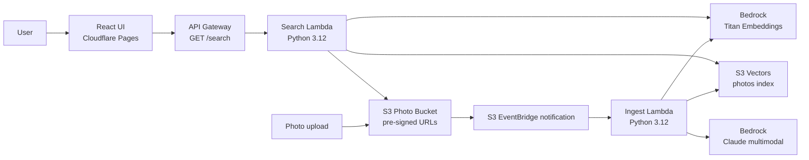

# PhotoScribe AI

[](https://github.com/manynames3/photoscribe-ai/actions/workflows/cloudflare-pages.yml)
[](https://github.com/manynames3/photoscribe-ai/actions/workflows/lambda-test.yml)
[](https://github.com/manynames3/photoscribe-ai/actions/workflows/terraform-plan.yml)
[](https://photoscribe-ai.pages.dev/)
[](#architecture)
[](#deployment)
[](#tech-stack)

PhotoScribe AI is a serverless semantic photo search platform. Uploaded images are stored in Amazon S3, described with Amazon Bedrock Claude, embedded with Titan Text Embeddings, indexed in Amazon S3 Vectors, and searched through a React + TypeScript UI deployed on Cloudflare Pages.

**Live demo:** [photoscribe-ai.pages.dev](https://photoscribe-ai.pages.dev/)

## About

This project demonstrates how I design, deploy, and operate a small cloud-native application with infrastructure as code, least-privilege IAM, CI/CD, cloud cost awareness, and production-style documentation. The user-facing app lets someone search a photo library by natural language instead of filenames or manually-entered tags.

What I built:

- an AWS ingest pipeline that reacts to S3 uploads and creates AI-generated photo metadata
- a vector search backend using Bedrock embeddings and S3 Vectors
- a public HTTP search API backed by AWS Lambda and API Gateway
- a responsive React interface with metadata filters and signed image previews
- Terraform modules for storage, vectors, Lambdas, API Gateway, observability, and optional AWS frontend hosting
- GitHub Actions workflows for Cloudflare Pages deployment, Lambda tests, and Terraform planning

## Tech Stack

| Area | Technology |
|---|---|
| Frontend | React 18, TypeScript, Vite, CSS |
| Frontend hosting | Cloudflare Pages, Wrangler direct upload via GitHub Actions |
| API | Amazon API Gateway HTTP API |
| Compute | AWS Lambda, Python 3.12 |
| AI services | Amazon Bedrock Claude multimodal, Amazon Titan Text Embeddings v2 |
| Vector search | Amazon S3 Vectors |
| Storage | Amazon S3, S3 versioning, lifecycle rules, pre-signed URLs |
| Infrastructure | Terraform, AWS provider, AWS Cloud Control provider (`awscc`) |
| CI/CD | GitHub Actions, GitHub repository secrets and variables |
| Observability | CloudWatch Logs, log retention, SNS billing alarm |

## Engineering Highlights

- **Serverless runtime model:** S3 upload events trigger an ingest Lambda; search requests go through API Gateway to a separate query Lambda.
- **Semantic search:** Photo descriptions and user queries are embedded into the same 1024-dimensional vector space before nearest-neighbor search.
- **Least-privilege IAM:** Each Lambda has its own IAM role scoped to the Bedrock, S3, S3 Vectors, and CloudWatch resources it needs.
- **Cost-aware architecture:** S3 Vectors avoids always-on vector infrastructure for a low-volume portfolio workload.
- **Infrastructure as code:** Terraform defines AWS storage, vector, compute, API, observability, and optional frontend hosting resources.
- **CI/CD-ready frontend:** Every push can build and deploy the Vite frontend to Cloudflare Pages using a GitHub Actions secret for Cloudflare deploy access.
- **Public repo secret handling:** deploy credentials live in GitHub Actions secrets; only public values such as `VITE_API_URL` are exposed to the browser.

## Architecture

Detailed architecture documentation lives in [docs/architecture.md](docs/architecture.md).

High-level flow:



Architecture decision records are in [docs/adrs](docs/adrs/README.md).

## Repository Structure

```text
photoscribe-ai/
├── frontend/                  # React + TypeScript UI
├── lambdas/
│   ├── ingest/                # S3 upload processing, Bedrock description, vector writes
│   └── search/                # Query embedding, S3 Vectors search, signed image URLs
├── terraform/
│   ├── modules/               # Storage, vectors, ingest, search, frontend, observability
│   └── envs/                  # Environment variable files
├── scripts/                   # Remote state bootstrap and seed helpers
├── docs/                      # Architecture, ADRs, prompts, cost, S3 Vectors notes
└── .github/workflows/         # Cloudflare Pages, Lambda tests, Terraform workflows
```

## Local Development

Prerequisites:

- Node.js 20+
- Python 3.12+
- Terraform 1.9+
- AWS CLI configured for the target AWS account
- Bedrock model access enabled in the target region

Run the frontend locally:

```bash
cd frontend
npm ci
npm run dev
```

Run Lambda tests:

```bash
PYTHONPATH=. pytest lambdas -v --cov=lambdas --cov-report=term-missing
```

Build the frontend:

```bash
cd frontend
npm run build
```

## Deployment

The deployed app currently uses Cloudflare Pages for the frontend and AWS for the backend.

Frontend deployment:

- GitHub Actions workflow: [.github/workflows/cloudflare-pages.yml](.github/workflows/cloudflare-pages.yml)
- Build command: `npm ci && npm run build`
- Deploy command: `wrangler pages deploy frontend/dist`
- Required GitHub variables: `CLOUDFLARE_ACCOUNT_ID`, `CLOUDFLARE_PAGES_PROJECT_NAME`, `VITE_API_URL`
- Required GitHub secret: `CLOUDFLARE_API_TOKEN`

Backend deployment:

```bash
./scripts/bootstrap-remote-state.sh us-east-1
cd terraform
terraform init -backend-config=dev.backend.hcl
terraform plan -var-file=envs/dev.tfvars -var-file=envs/dev.cloudflare.tfvars
terraform apply
```

Useful Terraform outputs:

- `photo_bucket_name`
- `vector_bucket_name`
- `vector_index_arn`
- `search_api_url`

To seed photos after deploy:

```bash
./scripts/seed-photos.sh ./sample-photos "$(terraform -chdir=terraform output -raw photo_bucket_name)"
```

## Testing

Automated checks available in the repo:

- `npm run build` in `frontend/`
- `PYTHONPATH=. pytest lambdas -v --cov=lambdas --cov-report=term-missing`
- `terraform fmt -check -recursive`
- `terraform validate`
- `git diff --check`

Manual smoke test:

1. Upload a JPEG to the photo bucket.
2. Confirm the ingest Lambda logs an `indexed` entry in CloudWatch.
3. Call `GET /search?q=<query>` on the API Gateway URL.
4. Open the Cloudflare Pages frontend and confirm results render with signed image URLs.

## Security And Privacy

- S3 photo buckets block public access.
- Search results return short-lived pre-signed S3 URLs instead of public bucket objects.
- API Gateway CORS is configured for known frontend origins.
- Lambda IAM policies are scoped to the resources used by each function.
- GitHub Actions uses secrets for deployment credentials.
- CloudWatch log groups use retention policies.
- A development billing alarm is provisioned through Terraform.

Current privacy limitation: this is a portfolio/demo deployment. The search API is public and does not include end-user authentication, so demo photos should be treated as public-facing content once indexed.

## Cost Model

The architecture is designed for low-volume portfolio usage. The main cost driver is Bedrock image description during ingest; S3 storage, S3 Vectors storage, Lambda, and API Gateway are small at demo scale. See [docs/cost-model.md](docs/cost-model.md) for notes and assumptions.

## Limitations

- The public demo has no user authentication.
- Search returns signed URLs for the original uploaded objects; a thumbnail generation pipeline is future work.
- The Terraform repo still includes optional AWS S3 + CloudFront frontend hosting modules, but the active public frontend is Cloudflare Pages.
- The Cloudflare Pages project is a direct-upload project, not Cloudflare Git integration.
- The vector index is optimized for low-volume demo workloads, not multi-tenant enterprise photo libraries.

## Troubleshooting

**Bedrock access errors:** confirm model access is enabled for Claude and Titan in the selected AWS region.

**No search results:** verify the ingest Lambda ran, then check the S3 Vectors index for stored vectors.

**CORS errors:** confirm API Gateway allows the exact frontend origin, including `https://photoscribe-ai.pages.dev`.

**Cloudflare deploy failures:** confirm `CLOUDFLARE_API_TOKEN` is a GitHub Actions secret with Cloudflare Pages edit permission.

## Future Work

- Add Cognito or another auth layer for private libraries.
- Generate and serve responsive thumbnails.
- Add a re-indexing workflow for prompt/model changes.
- Add CloudWatch dashboards and alarms for API 5xx, Lambda errors, and ingest latency.
- Add a public runbook for incident response and operations.

## License

MIT. See `LICENSE`.
