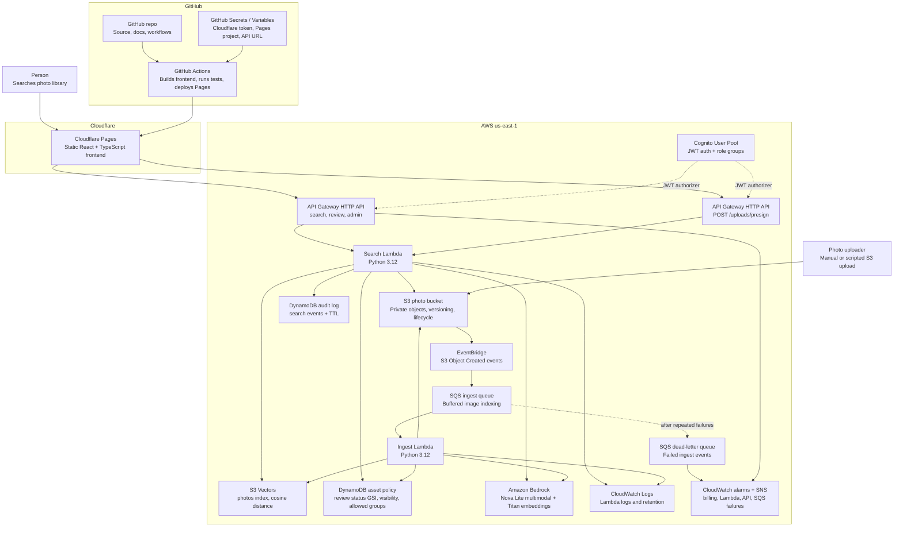

# Architecture

PhotoScribe AI is a serverless semantic media search system for governed image libraries. The frontend is a static React application on Cloudflare Pages. The backend runs on AWS with S3 for private photo storage, SQS for buffered ingest, Lambda for ingest and search, API Gateway for HTTP access, Cognito JWT authentication, Bedrock for image description and embeddings, S3 Vectors for vector search, and DynamoDB for asset policy and audit records.

## Container Diagram

## Runtime Flow

### Ingest

1. A JPEG, PNG, or WebP is uploaded to the private S3 photo bucket.
2. S3 emits an Object Created event through EventBridge.
3. EventBridge sends the event to SQS.
4. The ingest Lambda polls SQS with capped event-source concurrency.
5. Failed messages are retried and then moved to a dead-letter queue after repeated failures.
6. The ingest Lambda downloads the object from S3 and skips unsupported media types.
7. Bedrock Nova Lite returns structured photo metadata: description, alt text, caption, subjects, colors, mood, scene type, lighting, time of day, people count, and aspect ratio.
8. Bedrock Titan Text Embeddings v2 embeds the generated description into a 1024-dimensional vector.
9. The ingest Lambda writes the vector and metadata to the S3 Vectors `photos` index.
10. The ingest Lambda creates or updates a DynamoDB asset policy row for the S3 key, preserving existing human review decisions with `if_not_exists`.
11. New assets default to `pending_review` so reviewers can assign department, consent, usage-rights, campaign, staff, location, visibility, and release metadata before broader library use.
12. The Lambda writes structured log entries to CloudWatch.

### Search

1. A user submits a natural-language query from the React UI.
2. The UI calls `GET /search?q=<query>` on API Gateway.
3. API Gateway validates a Cognito JWT before invoking Lambda.
4. The search Lambda extracts Cognito groups for policy checks.
5. The search Lambda embeds the query text with Titan Text Embeddings v2.
6. The search Lambda queries S3 Vectors for nearest neighbors and optional metadata filters.
7. For each match, the Lambda checks DynamoDB asset policy metadata before issuing a signed URL.
8. The Lambda writes a DynamoDB audit record with query, result count, denied count, principal ID, and TTL.
9. API Gateway returns JSON results to the UI.

### Review Queue

1. A reviewer opens the asset review queue from the React UI.
2. The UI calls `GET /assets/review` with the signed-in user's Cognito JWT.
3. API Gateway validates the JWT, and Lambda confirms the user belongs to `admin` or `reviewer`.
4. The Lambda queries the DynamoDB `review_status` index for `pending_review` assets instead of scanning the policy table.
5. The UI lets reviewers approve, restrict, reject, and enrich asset metadata.

### Browser Upload

1. A user selects or drags JPEG, PNG, or WebP files into the React upload panel.
2. The UI computes a SHA-256 content hash for each file and skips exact duplicates already selected in the current batch.
3. The UI calls `POST /uploads/presign` with filename, content type, file size, checksum, and the signed-in user's Cognito JWT.
4. API Gateway validates the JWT, and Lambda confirms the user belongs to a library role group.
5. The Lambda maps the checksum to a deterministic `uploads/sha256/<prefix>/<checksum>.<ext>` object key.
6. If that key already exists, the Lambda returns `duplicate: true` and no new S3 upload is performed.
7. If the key is new, the Lambda returns a short-lived pre-signed S3 `PUT` URL and required upload headers.
8. The browser uploads the file directly to private S3 without receiving AWS credentials.
9. S3 emits the same Object Created event used by scripted uploads, so the existing ingest pipeline indexes the image.

## Deployment Shape

- The frontend is deployed to Cloudflare Pages by `.github/workflows/cloudflare-pages.yml`.
- `main` deploys the production Pages site.
- Non-main branches can produce Pages branch previews through Wrangler's `--branch` option.
- AWS backend infrastructure is managed by Terraform from the `terraform/` directory.
- Terraform remote state is bootstrapped by `scripts/bootstrap-remote-state.sh`.
- The Terraform modules are split by responsibility: storage, vectors, ingest, search, auth, governance, frontend, and observability.
- AWS frontend hosting still exists as an optional Terraform module, but the active public site uses Cloudflare Pages.
- The active deployment uses `enable_api_auth = true` so search, upload, review, curator, and admin API routes require Cognito JWTs.
- Browser uploads require signed-in staff access. This prevents anonymous public uploads from triggering storage and Bedrock costs.
- S3 upload events are buffered through SQS, and the Lambda event-source mapping caps concurrent ingest invokes so Bedrock indexing bursts cannot consume all Lambda capacity and starve search/upload requests.
- Failed ingest events move to an SQS dead-letter queue after retries, and CloudWatch alarms notify on Lambda errors, API 5xx responses, queue backlog, and DLQ messages.

## Semantic Search Rationale

Traditional media libraries depend on manual tags. That breaks down in real organizations because tags are inconsistent, incomplete, and dependent on users guessing the right keyword. PhotoScribe instead uses Bedrock Nova Lite to generate natural-language descriptions and structured metadata, Titan Text Embeddings v2 to embed those descriptions into a shared semantic space, and S3 Vectors to retrieve assets by meaning proximity.

A query like `doctor reviewing results` can match images described as `physician`, `clinician`, or `reviewing chart`, even if nobody manually tagged the image with the exact search phrase.

## Key Constraints

- The portfolio deployment is now private-library oriented: users sign in with Cognito before searching or uploading.
- Cognito groups drive role checks for `admin`, `reviewer`, `marketing`, `hr`, `compliance`, and `facilities`.
- New assets default to `pending_review` and must be classified before broader library use.
- Existing indexed assets may not have policy rows. With `missing_asset_policy_default = "deny"`, legacy assets stay hidden until policy rows are backfilled.
- S3 Vectors is provisioned with the `awscc` provider because this repo uses Cloud Control coverage for vector bucket and index resources.
- Image description is the primary variable cost. Nova Lite is the default cost-effective model, Nova Pro is an affordable quality upgrade, and Claude can be configured for high-performance review workflows when its higher cost is justified.
- The current thumbnail strategy returns signed URLs for original objects. A generated thumbnail pipeline is future work.
- Cloudflare Pages deployment uses a GitHub Actions secret. The Cloudflare API token must never be committed or exposed to the browser.

## Operational Notes

- CloudWatch Logs are the first place to inspect ingest and search failures.
- API Gateway throttling is configured in Terraform.
- Terraform provisions a development billing alarm plus targeted operational alarms for Lambda errors, API 5xx responses, SQS queue age, and DLQ messages.
- DynamoDB audit logs are TTL-managed; they are useful for demo-scale traceability, not a replacement for centralized SIEM retention.
- GitHub Actions runs Lambda tests, frontend unit tests, frontend builds, Terraform validation, Terraform plans, and Cloudflare Pages deployment.
- `git diff --check`, Terraform formatting, Lambda tests, and frontend build should pass before changes are pushed.
