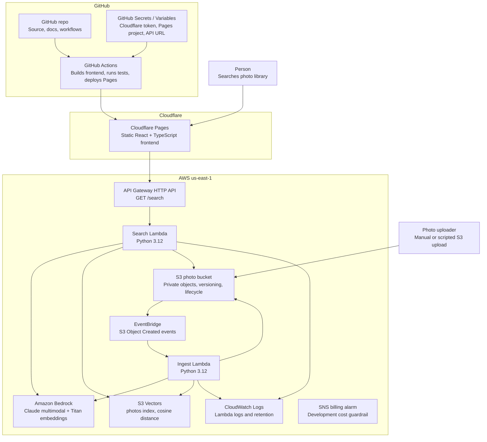

# Architecture

PhotoScribe AI is a serverless semantic photo search system. The frontend is a static React application on Cloudflare Pages. The backend runs on AWS with S3 for photo storage, Lambda for ingest and search, API Gateway for HTTP access, Bedrock for image description and embeddings, and S3 Vectors for vector search.

## Container Diagram

## Runtime Flow

### Ingest

1. A JPEG, PNG, or WebP is uploaded to the private S3 photo bucket.
2. S3 emits an Object Created event through EventBridge.
3. EventBridge invokes the ingest Lambda.
4. The ingest Lambda downloads the object from S3 and skips unsupported media types.
5. Bedrock Claude returns structured photo metadata: description, alt text, caption, subjects, colors, mood, scene type, lighting, time of day, people count, and aspect ratio.
6. Bedrock Titan Text Embeddings v2 embeds the generated description into a 1024-dimensional vector.
7. The ingest Lambda writes the vector and metadata to the S3 Vectors `photos` index.
8. The Lambda writes structured log entries to CloudWatch.

### Search

1. A user submits a natural-language query from the React UI.
2. The UI calls `GET /search?q=<query>` on API Gateway.
3. The search Lambda embeds the query text with Titan Text Embeddings v2.
4. The search Lambda queries S3 Vectors for nearest neighbors and optional metadata filters.
5. The Lambda generates short-lived pre-signed S3 URLs for matching photos.
6. API Gateway returns JSON results to the UI.

## Deployment Shape

- The frontend is deployed to Cloudflare Pages by `.github/workflows/cloudflare-pages.yml`.
- `main` deploys the production Pages site.
- Non-main branches can produce Pages branch previews through Wrangler's `--branch` option.
- AWS backend infrastructure is managed by Terraform from the `terraform/` directory.
- Terraform remote state is bootstrapped by `scripts/bootstrap-remote-state.sh`.
- The Terraform modules are split by responsibility: storage, vectors, ingest, search, frontend, and observability.
- AWS frontend hosting still exists as an optional Terraform module, but the active public site uses Cloudflare Pages.

## Key Constraints

- The demo search API is public and does not currently authenticate end users.
- Uploaded demo photos should be treated as public-facing once indexed because search results return signed image URLs.
- S3 Vectors is provisioned with the `awscc` provider because this repo uses Cloud Control coverage for vector bucket and index resources.
- Claude image description is the primary variable cost; repeated ingest should be avoided by treating the S3 object key as the vector key.
- The current thumbnail strategy returns signed URLs for original objects. A generated thumbnail pipeline is future work.
- Cloudflare Pages deployment uses a GitHub Actions secret. The Cloudflare API token must never be committed or exposed to the browser.

## Operational Notes

- CloudWatch Logs are the first place to inspect ingest and search failures.
- API Gateway throttling is configured in Terraform.
- A development billing alarm is provisioned through Terraform.
- GitHub Actions runs Lambda tests and frontend deployment checks.
- `git diff --check`, Terraform formatting, Lambda tests, and frontend build should pass before changes are pushed.
