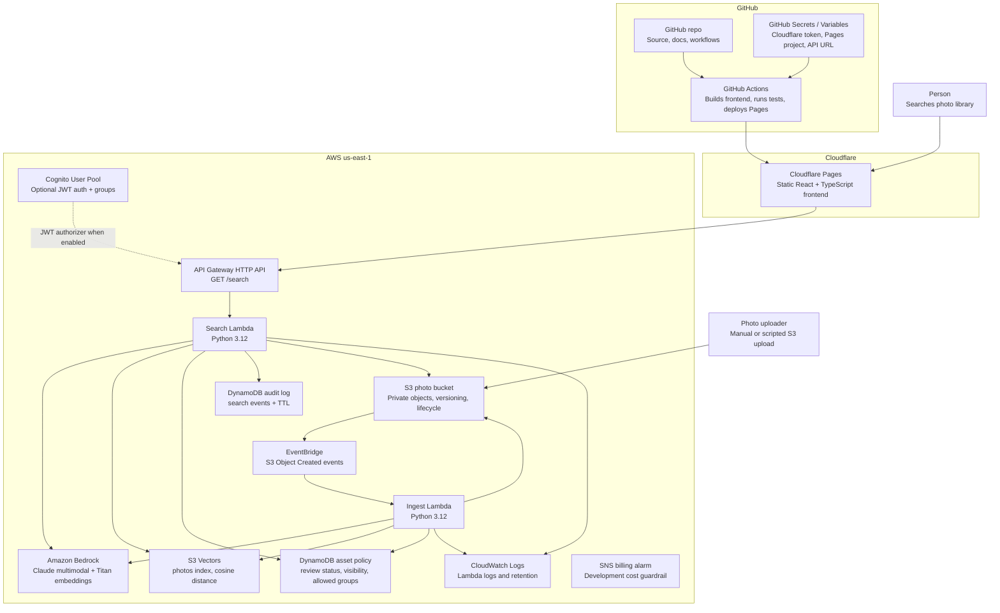

# Architecture

PhotoScribe AI is a serverless semantic media search system for governed image libraries. The frontend is a static React application on Cloudflare Pages. The backend runs on AWS with S3 for private photo storage, Lambda for ingest and search, API Gateway for HTTP access, optional Cognito JWT authentication, Bedrock for image description and embeddings, S3 Vectors for vector search, and DynamoDB for asset policy and audit records.

## Container Diagram

## Runtime Flow

### Ingest

1. A JPEG, PNG, or WebP is uploaded to the private S3 photo bucket.
2. S3 emits an Object Created event through EventBridge.
3. EventBridge invokes the ingest Lambda.
4. The ingest Lambda downloads the object from S3 and skips unsupported media types.
5. Bedrock Claude returns structured photo metadata: description, alt text, caption, subjects, colors, mood, scene type, lighting, time of day, people count, and aspect ratio.
6. Bedrock Titan Text Embeddings v2 embeds the generated description into a 1024-dimensional vector.
7. The ingest Lambda writes the vector and metadata to the S3 Vectors `photos` index.
8. The ingest Lambda creates or updates a DynamoDB asset policy row for the S3 key, preserving existing human review decisions with `if_not_exists`.
9. The Lambda writes structured log entries to CloudWatch.

### Search

1. A user submits a natural-language query from the React UI.
2. The UI calls `GET /search?q=<query>` on API Gateway.
3. When `enable_api_auth = true`, API Gateway validates a Cognito JWT before invoking Lambda.
4. The search Lambda extracts Cognito groups when present, or treats the request as an anonymous public-demo request.
5. The search Lambda embeds the query text with Titan Text Embeddings v2.
6. The search Lambda queries S3 Vectors for nearest neighbors and optional metadata filters.
7. For each match, the Lambda checks DynamoDB asset policy metadata before issuing a signed URL.
8. The Lambda writes a DynamoDB audit record with query, result count, denied count, principal ID, and TTL.
9. API Gateway returns JSON results to the UI.

## Deployment Shape

- The frontend is deployed to Cloudflare Pages by `.github/workflows/cloudflare-pages.yml`.
- `main` deploys the production Pages site.
- Non-main branches can produce Pages branch previews through Wrangler's `--branch` option.
- AWS backend infrastructure is managed by Terraform from the `terraform/` directory.
- Terraform remote state is bootstrapped by `scripts/bootstrap-remote-state.sh`.
- The Terraform modules are split by responsibility: storage, vectors, ingest, search, auth, governance, frontend, and observability.
- AWS frontend hosting still exists as an optional Terraform module, but the active public site uses Cloudflare Pages.
- The public portfolio deployment keeps `enable_api_auth = false`; private deployments can set `enable_api_auth = true` to require Cognito JWTs on `GET /search`.

## Semantic Search Rationale

Traditional media libraries depend on manual tags. That breaks down in real organizations because tags are inconsistent, incomplete, and dependent on users guessing the right keyword. PhotoScribe instead uses Bedrock Claude to generate natural-language descriptions and structured metadata, Titan Text Embeddings v2 to embed those descriptions into a shared semantic space, and S3 Vectors to retrieve assets by meaning proximity.

A query like `doctor reviewing results` can match images described as `physician`, `clinician`, or `reviewing chart`, even if nobody manually tagged the image with the exact search phrase.

## Key Constraints

- The public demo search API is intentionally unauthenticated for recruiter review; uploaded demo photos should be treated as public-facing once indexed because search results return signed image URLs.
- Cognito/JWT auth is optional and controlled by Terraform. Enabling it requires a frontend login/token flow; the current UI can attach a token from `localStorage["photoscribe.authToken"]`.
- New assets default to `approved` in the public demo. A private review queue should set `default_asset_review_status = "pending_review"`.
- Existing indexed assets may not have policy rows. Keep `missing_asset_policy_default = "allow"` during migration, then change it to `deny` after backfilling policy rows.
- S3 Vectors is provisioned with the `awscc` provider because this repo uses Cloud Control coverage for vector bucket and index resources.
- Claude image description is the primary variable cost; repeated ingest should be avoided by treating the S3 object key as the vector key.
- The current thumbnail strategy returns signed URLs for original objects. A generated thumbnail pipeline is future work.
- Cloudflare Pages deployment uses a GitHub Actions secret. The Cloudflare API token must never be committed or exposed to the browser.

## Operational Notes

- CloudWatch Logs are the first place to inspect ingest and search failures.
- API Gateway throttling is configured in Terraform.
- A development billing alarm is provisioned through Terraform.
- DynamoDB audit logs are TTL-managed; they are useful for demo-scale traceability, not a replacement for centralized SIEM retention.
- GitHub Actions runs Lambda tests and frontend deployment checks.
- `git diff --check`, Terraform formatting, Lambda tests, and frontend build should pass before changes are pushed.
